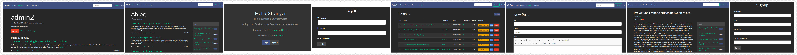

# Ablog

## DEMO

This project is hosted on [pythonanywhere](http://misaki001.pythonanywhere.com/) now.

## Preview



## Introduction

~~Ablog is a Content Management System written in Python.~~:stuck_out_tongue_winking_eye:

Ablog is a lightweight framework to build blogs for now maybe forever.

Ablog is not finished, more features to be implemented and more bugs to be fixed(hope not :sob: ).

It is powered by [Python](https://www.python.org/) and [Flask](http://flask.pocoo.org/). :two_hearts:

## Quick Start

> NOTE: Ablog requires Python 3.7+.

```
# clone the project
git clone https://github.com/python-myway/ablog.git

# build a Python vitual environment
cd ablog
python3 -m venv venv

# activate the env and install requirements
source venv/bin/activate
pip3 install -r requirements.txt

# before you start the server, do some init.
mkdir logs
touch logs/ablog.log
flask initdb
flask fakedata

# then you can run locally.
flask run

# then access http://localhost:5000.
# there are some fake people using ablog.
# the default user and passwd pairs are {'admin0': 'admin0', 'admin1': 'admin1',...'admin4': 'admin4'}

```

## Deploy

> NOTE: the dir `deploy` have all the configs.

- This [blog](https://python-myway.github.io/2017/09/16/%E9%83%A8%E7%BD%B2%E6%9C%8D%E5%8A%A1%E5%99%A8/) will teach you how to deploy.

## Features(some are to be implemented)

- :ballot_box_with_check: signup/login
- :ballot_box_with_check: add/delete/check articles/categories
- :ballot_box_with_check: add/delete comments
- :ballot_box_with_check: enable/disable comment
- :ballot_box_with_check: follow/unfollow bloger
- :ballot_box_with_check: full text search
- :ballot_box_with_check: manage personal profile
- :ballot_box_with_check: responsive website design
- :ballot_box_with_check: support rich text
- :ballot_box_with_check: deploy with Nginx and uwsgi
- :ballot_box_with_check: Message notice
- :ballot_box_with_check: signup confirm email(the email box not ready yet, still looking one)
- :ballot_box_with_check: forget password / reset password
- :black_square_button: user profile
- :black_square_button: related articles recommended (based on similar category)
- :black_square_button: UI enhance
- :black_square_button: api
- :black_square_button: role part

## Tips

- all configs are located in ablog/settings.py.
- it's better to write a .flaskenv file in this dir, then put `FLASK_ENV=development` in the file or you can just type `export FLASK_ENV=development` in the cmd.
- delete a category won't all articles tied in it, these articles will belong to `Category(name=defalut, author=superadmin)`.
- use `whooshee.reindex()` to manually create index for `whooshee`.

## Thanks for

- [Flask web开发实战](https://github.com/greyli/bluelog)

- [Flask web开发](https://github.com/miguelgrinberg/flasky)